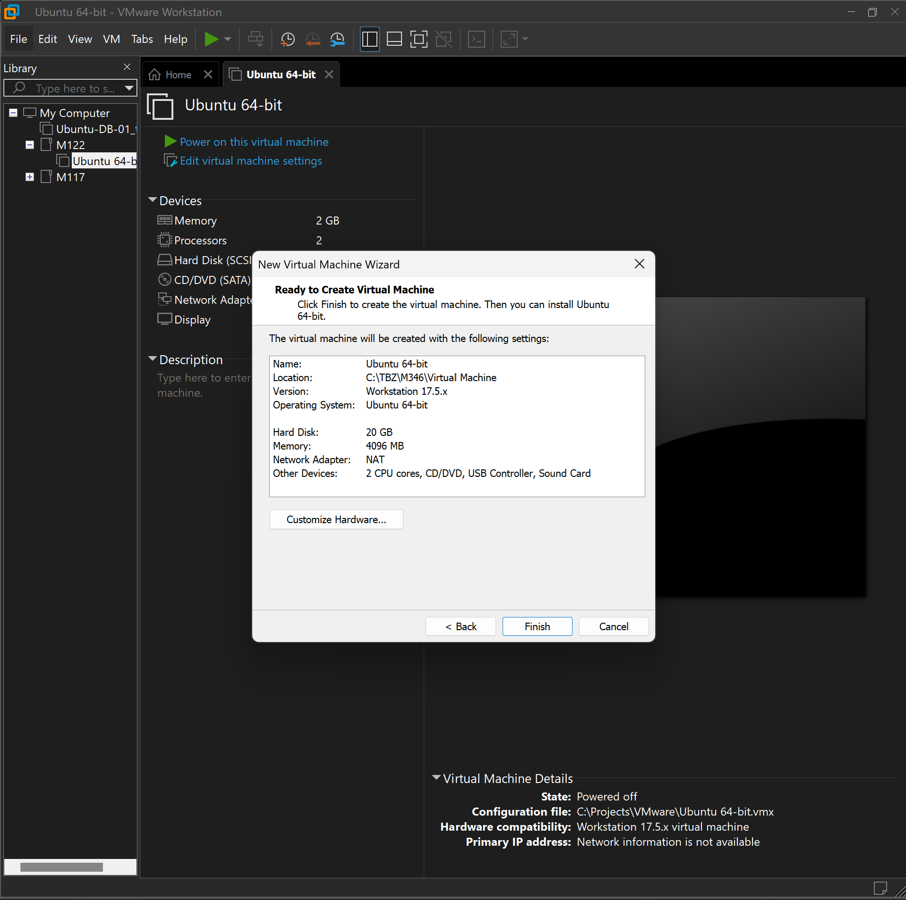
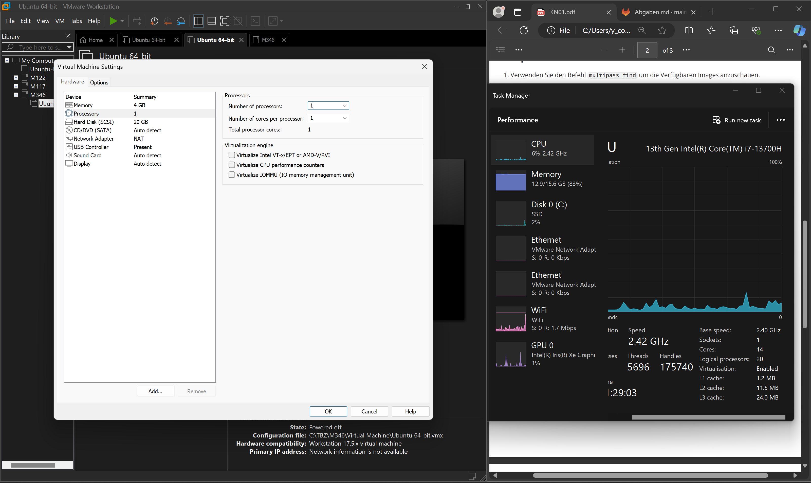
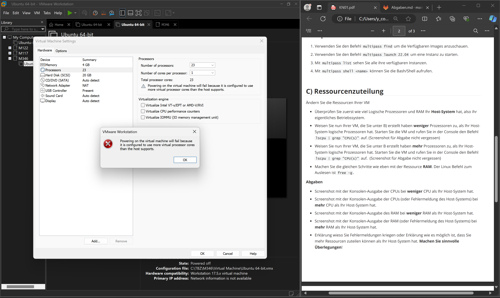
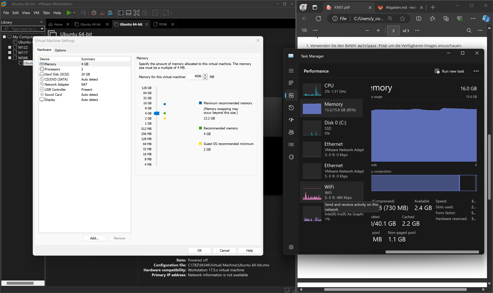

#### Erklärungen

Man erhält Fehlermeldungen wenn man mehr Prozessoren und Memory in der VM definiert als was man auf dem lokalen Rechner hat.
Der Grund dafür ist, dass der lokale Computer überlastet wird, da er selber diese Anzahl von Ressourcen nicht hat. 

##### weniger CPUs als lokalen Rechner

##### mehr CPUs als lokalen Rechner

 
##### weniger RAM als lokalen Rechner

##### mehr RAM als lokalen Rechner

