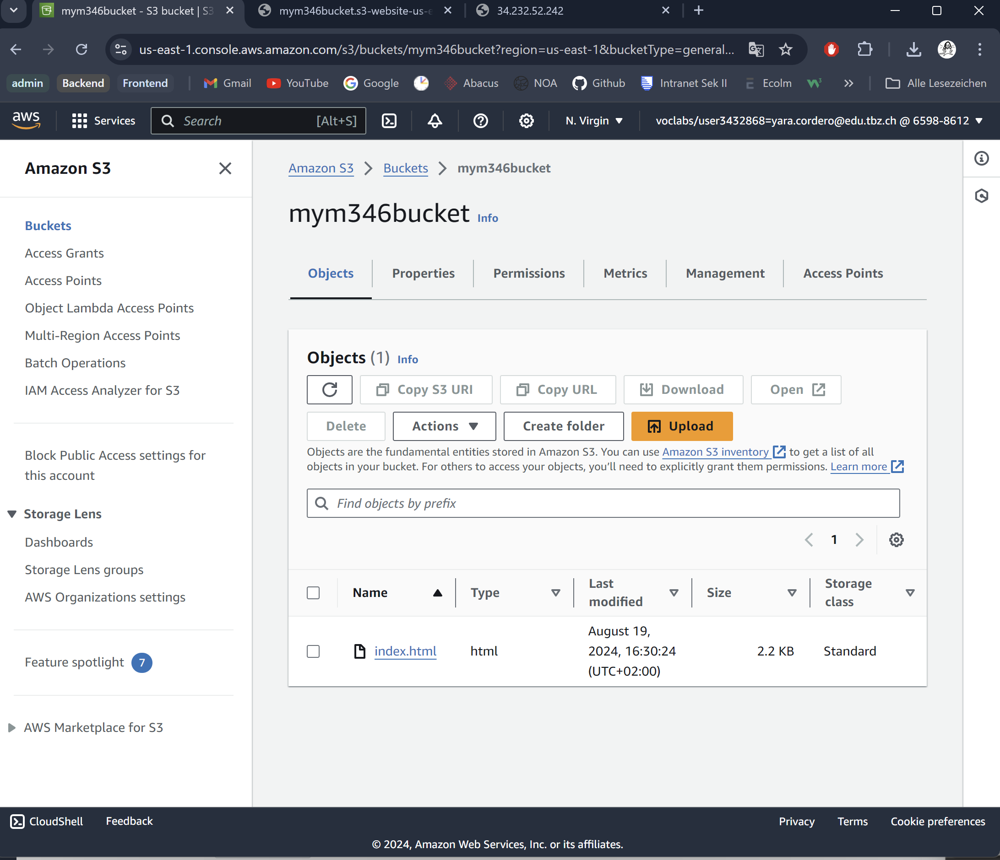

### KN02

#### Lab 4.1

##### HTML-Seite, inkl. URL

##### Liste der EC2-Instanzen

##### Details der Web Server-Instanz (öffentliche IP sichtbar)

##### Security-Group: Liste der Inbound-Regeln.

#### Lab 4.2 

##### Liste der Buckets

##### HTML-Seite, inkl. URL.

##### Liste der Dateien im Bucket.

##### Eigenschaften von "Static website hosting".

##### JSON-Datei mit der Bucket-Poly für den öffentlichen Zugriff

