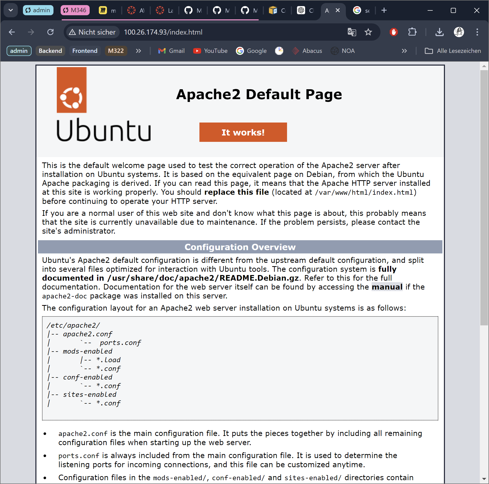
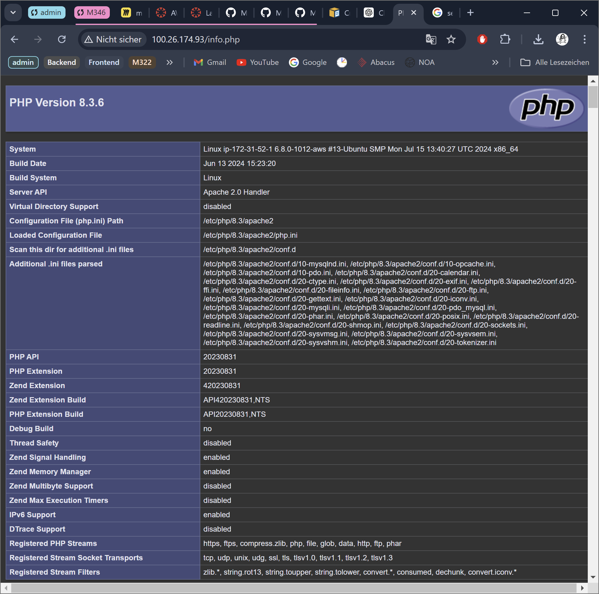

# KN03
## Installation von Web- und Datenbankserver

###### http://[ihre-IP]/index.html 

###### http://[ihre-IP]/info.php

###### http://[ihre-IP]/db.php

## Elastic Block Storage (EBS) hinzufügen. 

###### Liste der EBS(2 Volumen) der Instanz

##### Erklärung für was eibe zusätzliche virtuelle Disk verwendet wird

Im Internet habe ich verschiedene Beispiele gefunden, für was man zusätzliche virtuelle Disk verwendet wird.
- Es wird gebraucht um das Betriebssystem und Daten getrennt zu behalten. Es erleichtert die Verwaltung und macht die Wiederherstellung bei Systemproblemen einfacherer.
- Es kann für mehr Speicher gebraucht werden, bei Applikationen die datenintensiver sind wie bwsp. Datenbanken.
- Es kann für Backups verwendet werden.
