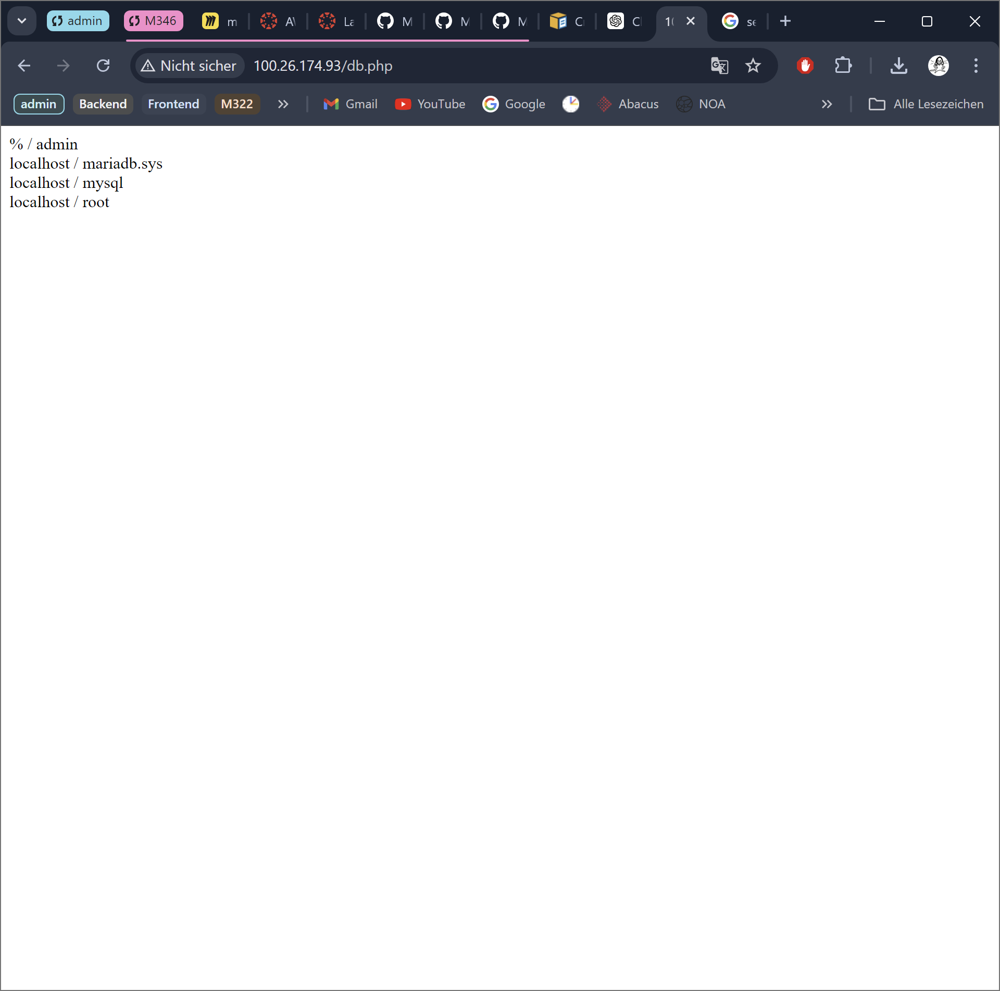

# KN03
## Installation von Web- und Datenbankserver

###### http://[ihre-IP]/index.html 

###### http://[ihre-IP]/info.php

###### http://[ihre-IP]/db.php

## Elastic Block Storage (EBS) hinzufügen. 

###### Liste der EBS(2 Volumen) der Instanz

