# KN04

## Diagramm erstellen

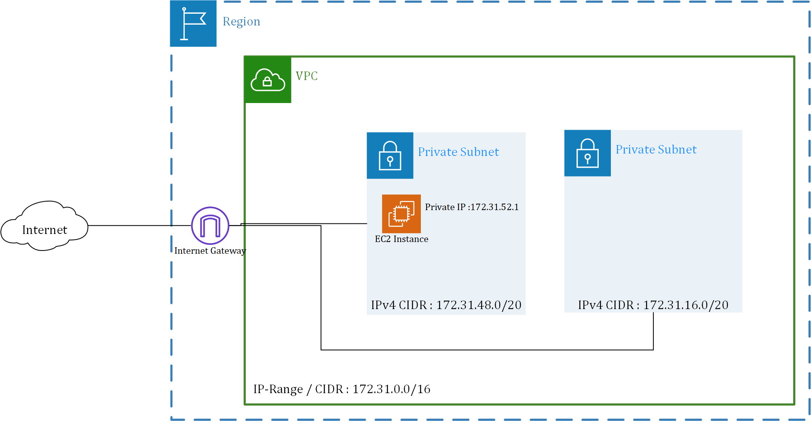

## Subnetze und private IP wählen

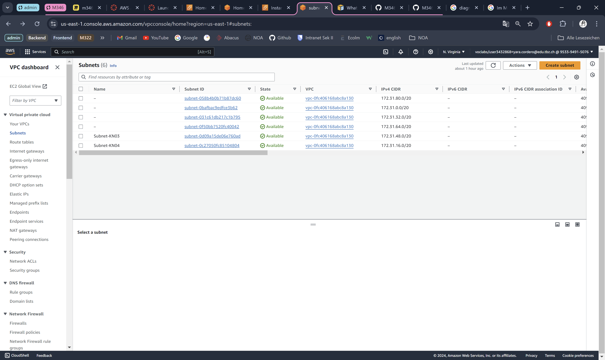

### Subnet-KN04

Availability Zone : us-east-1c

IPv4 CIDR : **172.31.16.0/20**

IP-Adresse 1 : **172.31.16.20**
 
IP-Adresse 2 -> DB : **172.31.48.20**

### Sicherheitsgruppe 

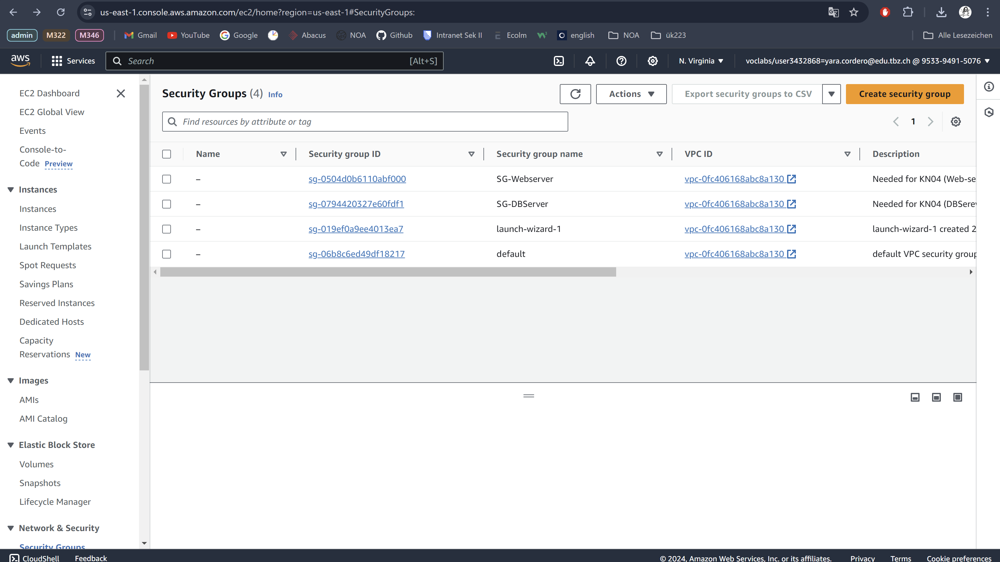

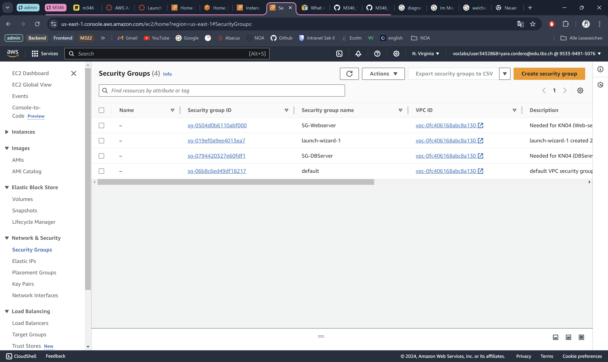

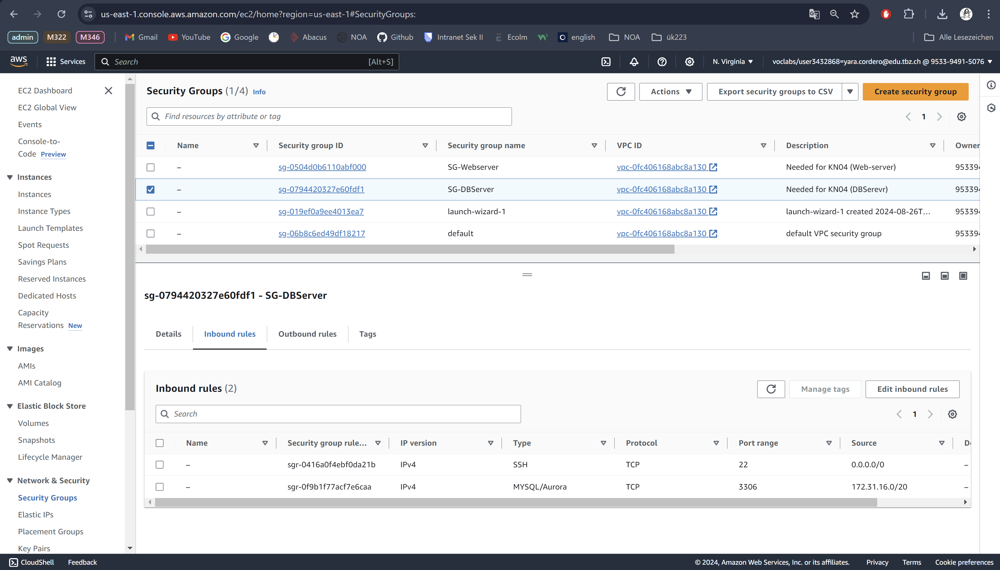

### Elastic IPs

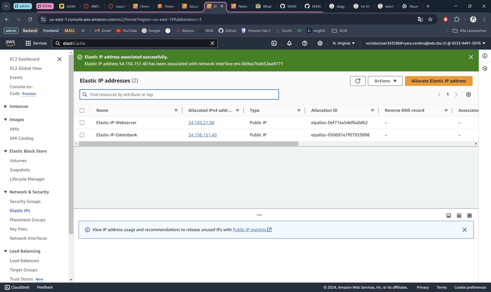

### Netzwerk Interface

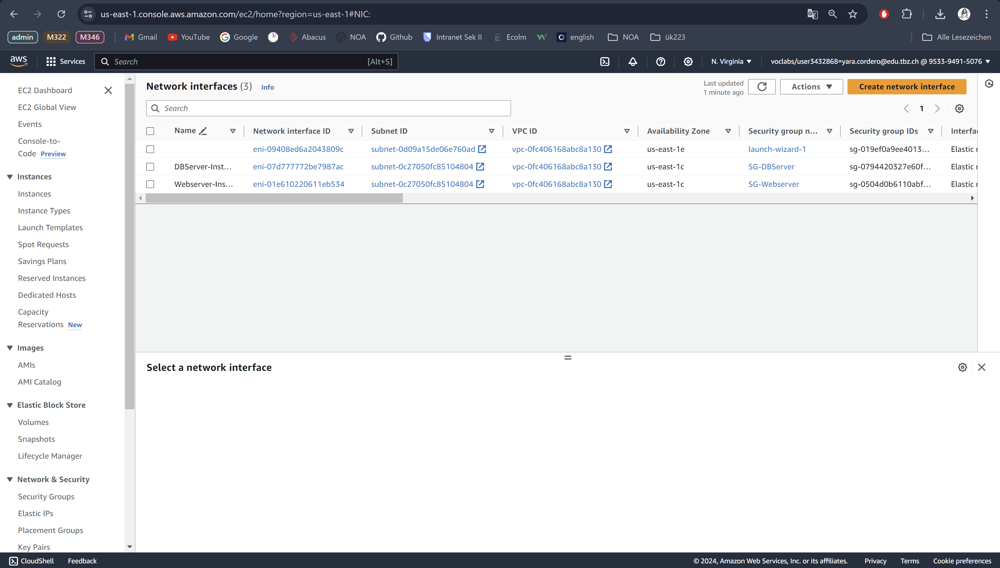

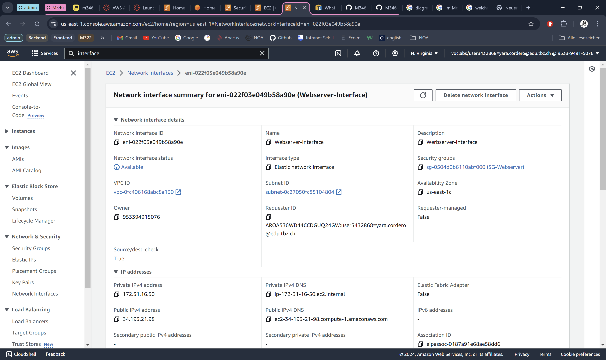

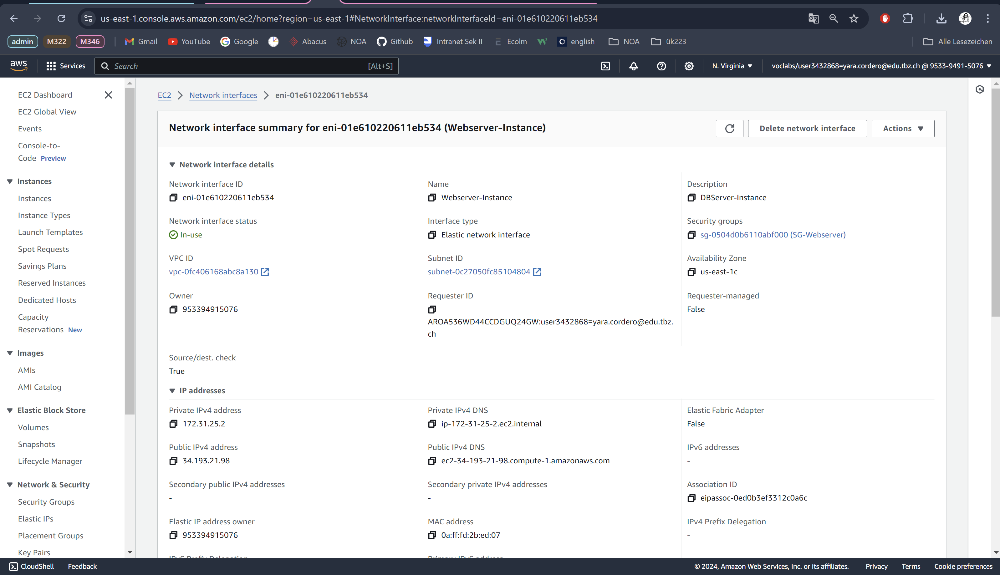

### Instanz 

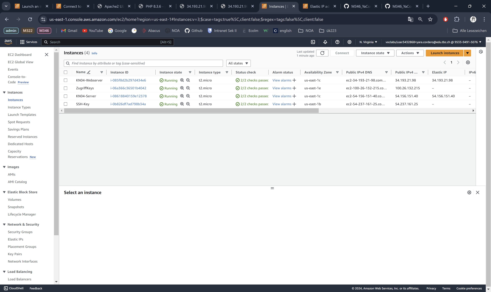

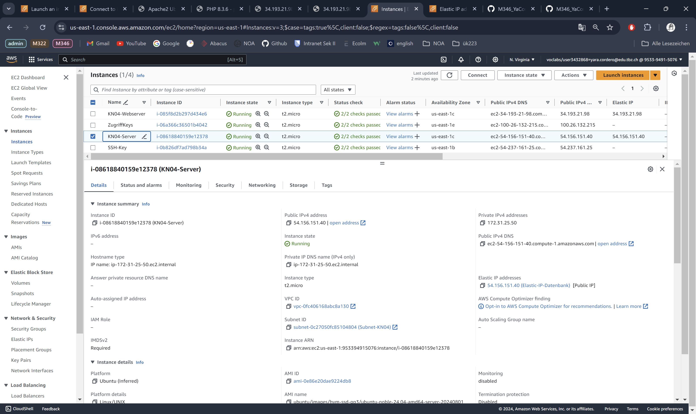

### Datei Anpassung

*db.php*

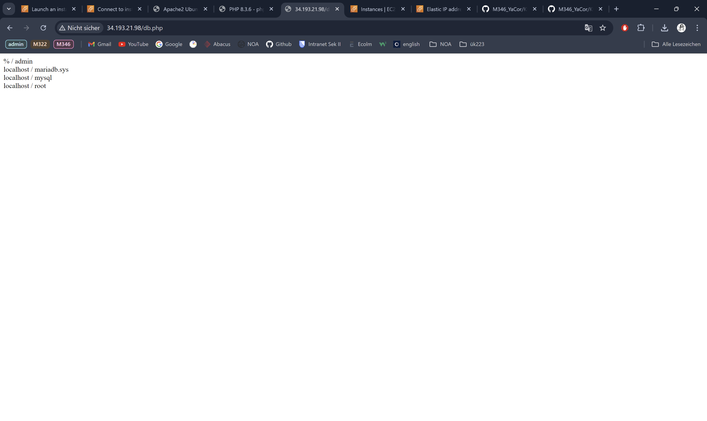

*info.php*

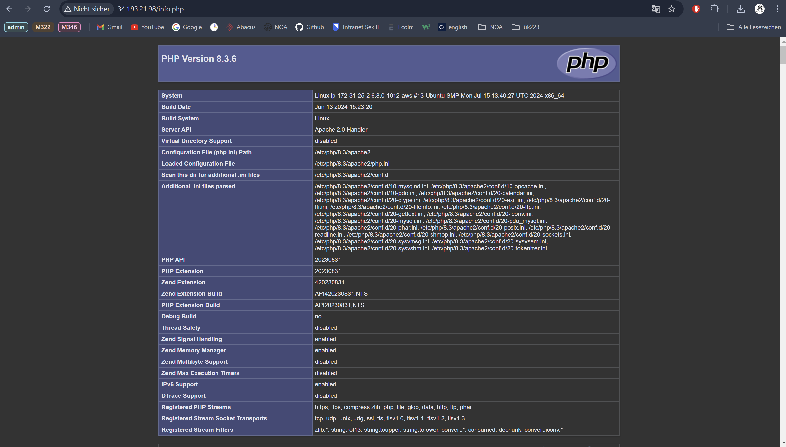

*index.html*

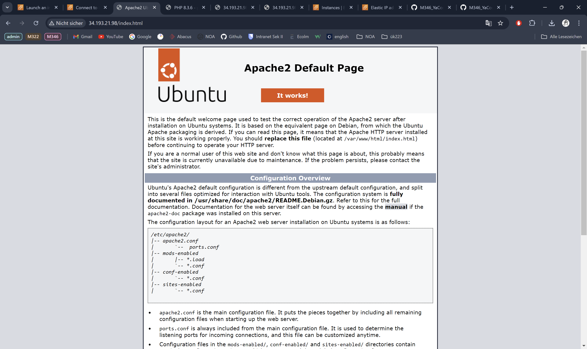
