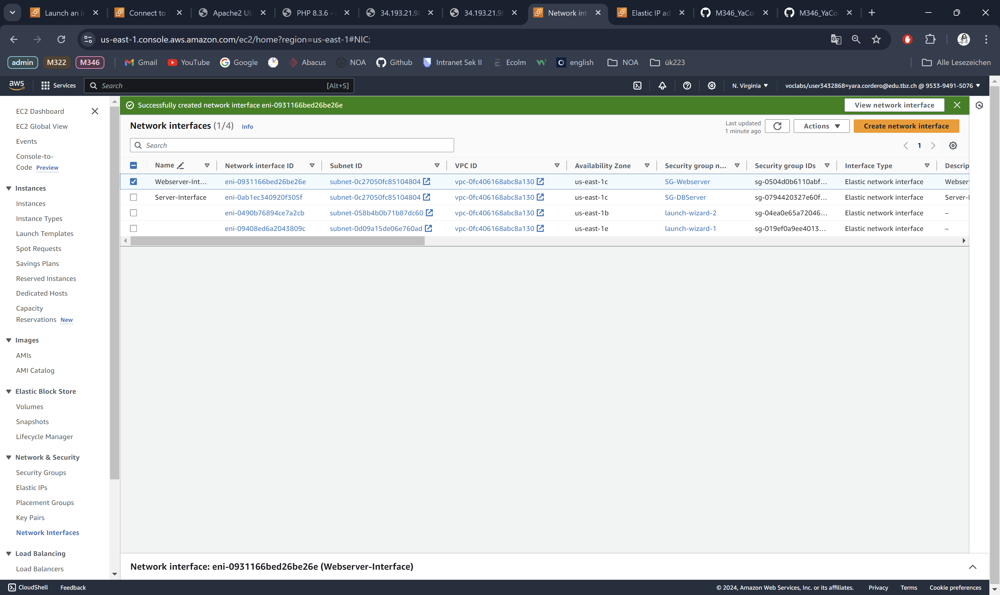
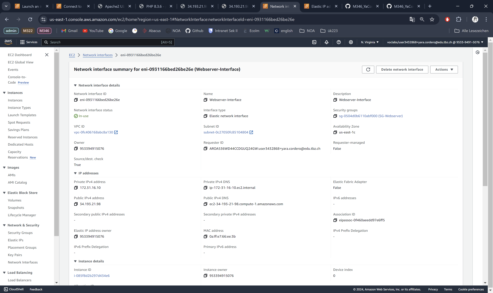
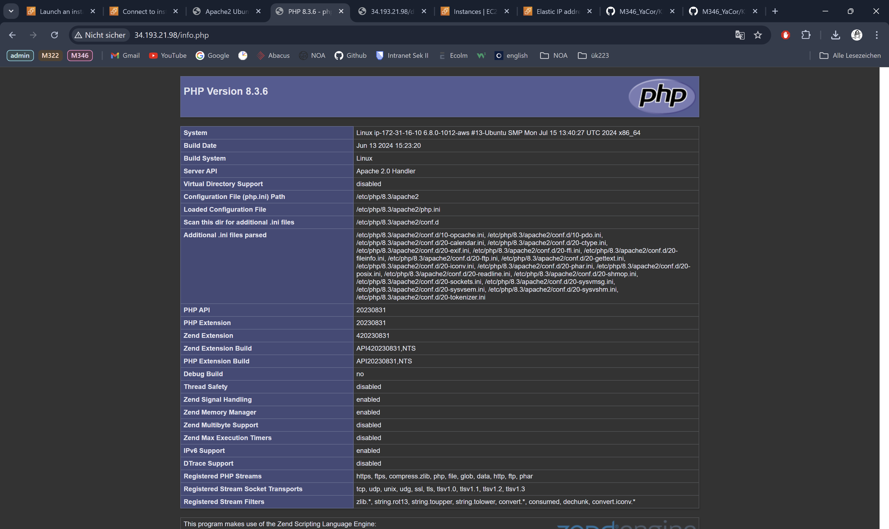

# KN04

## Diagramm erstellen

## Subnetze und private IP wählen

### Subnet-KN04

Availability Zone : us-east-1c

IPv4 CIDR : **172.31.16.0/20**

IP-Adresse 1 : **172.31.16.20**
 
IP-Adresse 2 -> DB : **172.31.48.20**

### Sicherheitsgruppe 

### Elastic IPs

### Netzwerk Interface

### Instanz 

### Datei Anpassung

*db.php*

*info.php*

*index.html*

