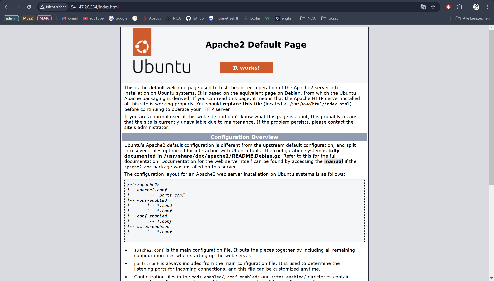
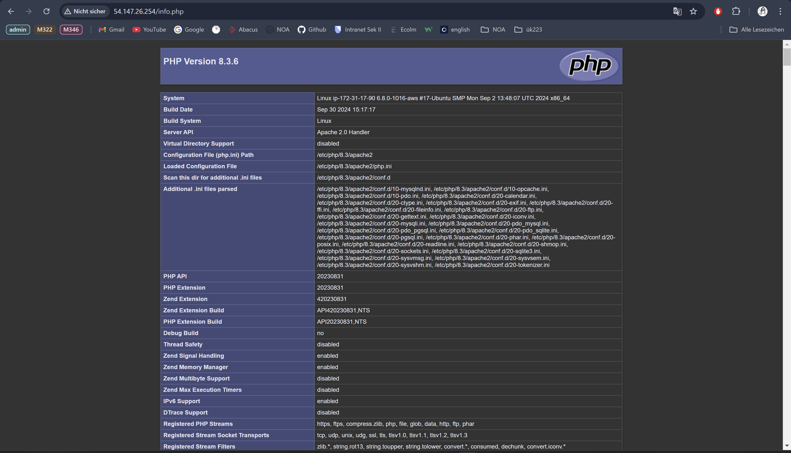
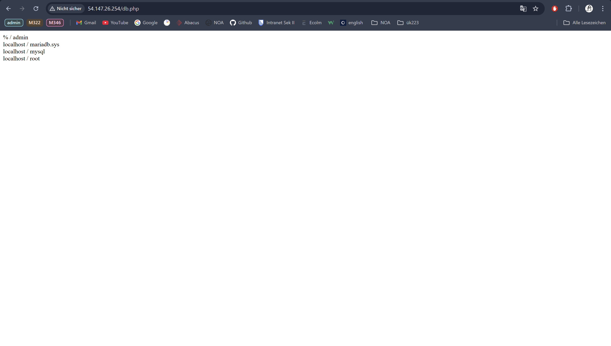
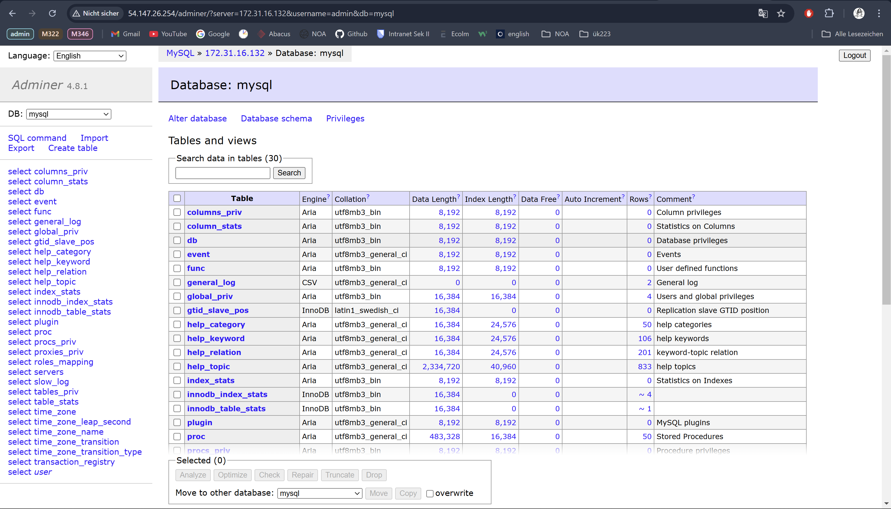

# KN05

## Cloud-init Datei Verstehen

[Cloud-init Datei](cloud-init.yaml)

## SSH-Key und Cloud-init 

Command zu Public-Key extrahierung 
 
`$ ssh-keygen -y -f C:\Users\y_cor\Downloads\Yara1.pem > C:\Users\y_cor\Downloads\Yara1.pub`
`$ ssh-keygen -y -f C:\Users\y_cor\Downloads\Yara2.pem > C:\Users\y_cor\Downloads\Yara2.pub`

##### Key Konfiguration für die Instanz

### Ersten Private Key

### Zweiten Private Key

### Auszug der Cloud-init-Log

## Installation automatisieren

[Cloud-init Datei für DB](cloud-init-db.yaml)
[Cloud-init Datei für Webserver](cloud-init-web.yaml)

### index.html

### info.php

### db.php

### Adminer 

