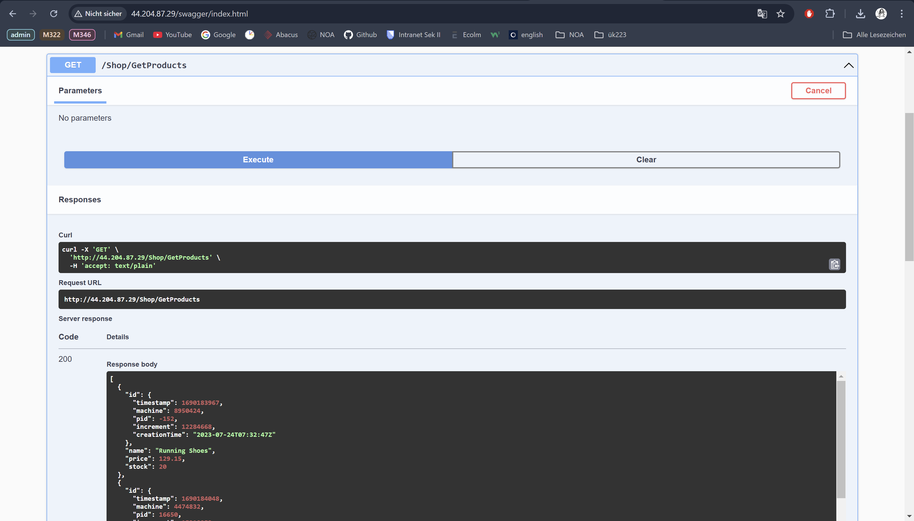

# KN06

## Installation App 

#### Was ist eine Reverse Proxy? 

Was ich unter Reverse Proxy verstanden habe, ist das es eine Art Middle Man ist zwischen Service und Kunde. Er empfängt die Anfragen und leitet sie an das benötigte Backend-Service weiter.

## Vertikale Skalierung 

Das verändern der Disk grösse konnte ich währenddessen es lauft verändern. Beim verändern der Instanzen jedoch musste ich zuerst die Instanz stoppen.
Danach konnte ich bei den "Instance Settings" den Instanz Typ ändern.

### Vorher 

### Nachher

##### Horizontale Skalierung 

Um die Applikation unter der URL app.tbz-m346.ch bereitzustellen, muss ein A-Record erstellt werden. Dieser A-Record verknüpft die URL app.tbz-m346.ch mit dem DNS-Namen des Load Balancers: Um die Applikation unter der URL app.tbz-m346.ch bereitzustellen, muss ein A-Record erstellt werden. Dieser A-Record verknüpft die URL app.tbz-m346.ch (zum Beispiel anik.app.tbz-m346.ch) mit dem DNS-Namen des Load Balancers: Um die Applikation unter der URL app.tbz-m346.ch bereitzustellen, muss ein A-Record erstellt werden. Dieser A-Record verknüpft die URL app.tbz-m346.ch (zum Beispiel anik.app.tbz-m346.ch) mit dem DNS-Namen des Load Balancers: kn06-lb-1218975619.us-east-1.elb.amazonaws.com.

### Auto Scaling

### Evaluation Cloud-Init

Das Cloud-Init File ist nicht sicher, da das Passwort, Username und Link zum DB "öffentlich" im File geschrieben sind.
Solche Daten sollten eher von einem File herausgelesen als im Cloud-Init File explizit ausgeschrieben zu werden.

### Adminer 

