# KN07

## Applikation erstellen

##### Configure Enviroment

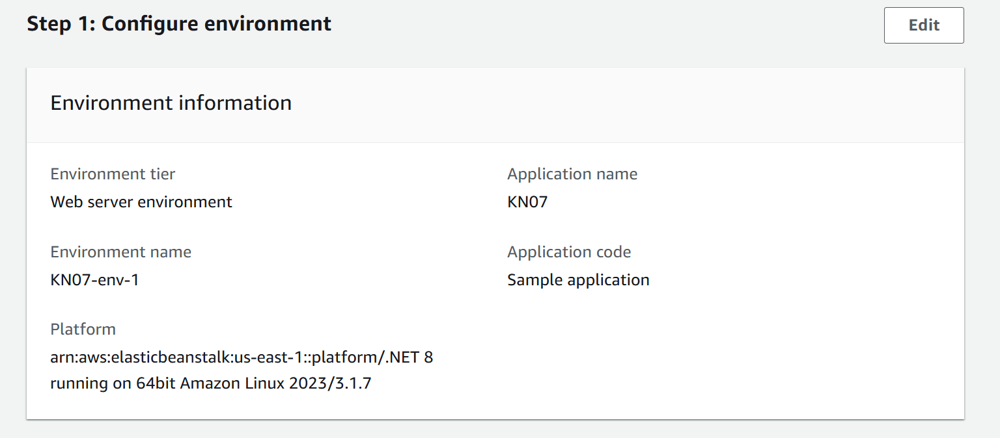

##### Configure service access

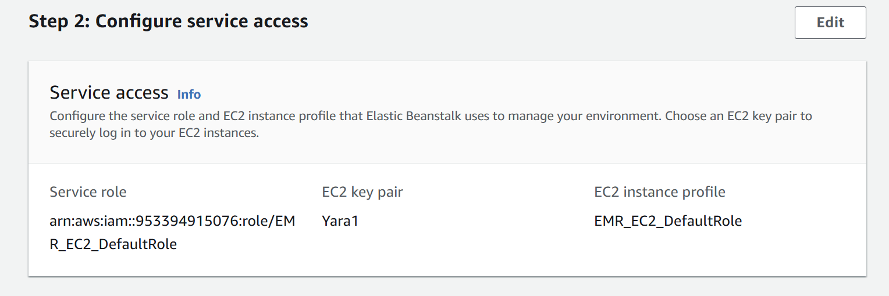

##### Configure Set up nertworking, database, adn tags

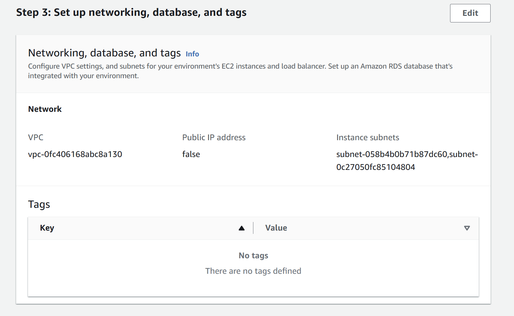

##### Configure instance traffic and scaling

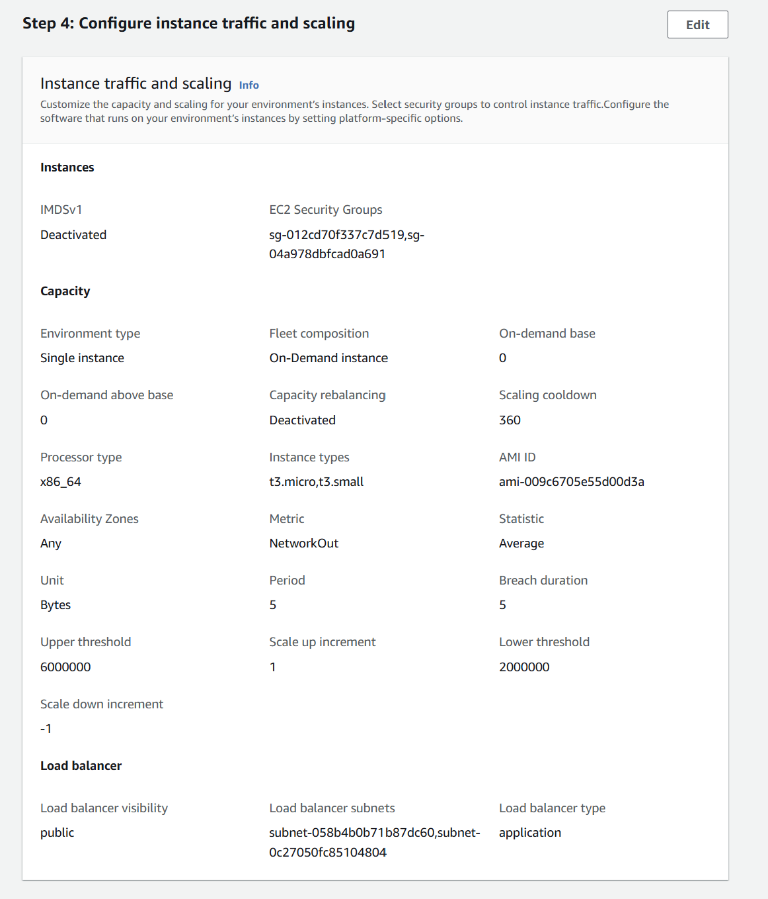

##### Configure updates, monitoring, and logging

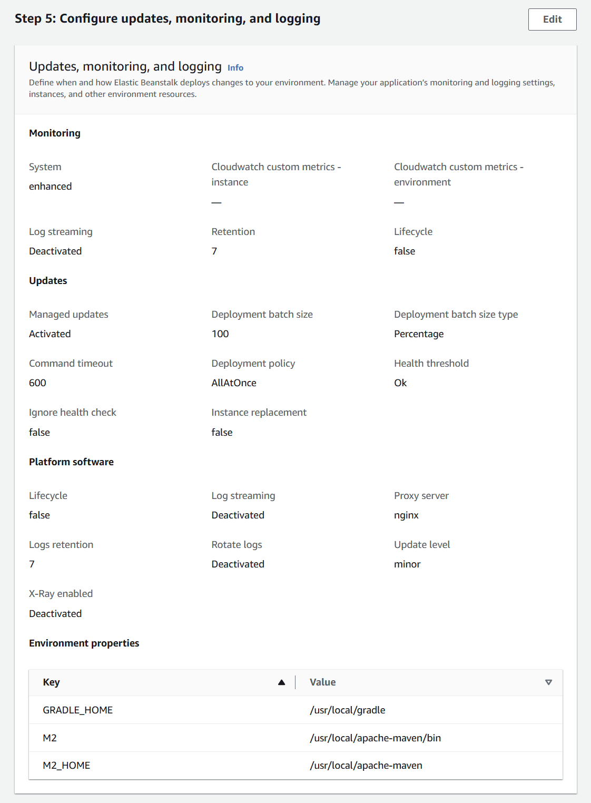

## Erstellte Ressource/Objekte und CloudFormation

##### Instance

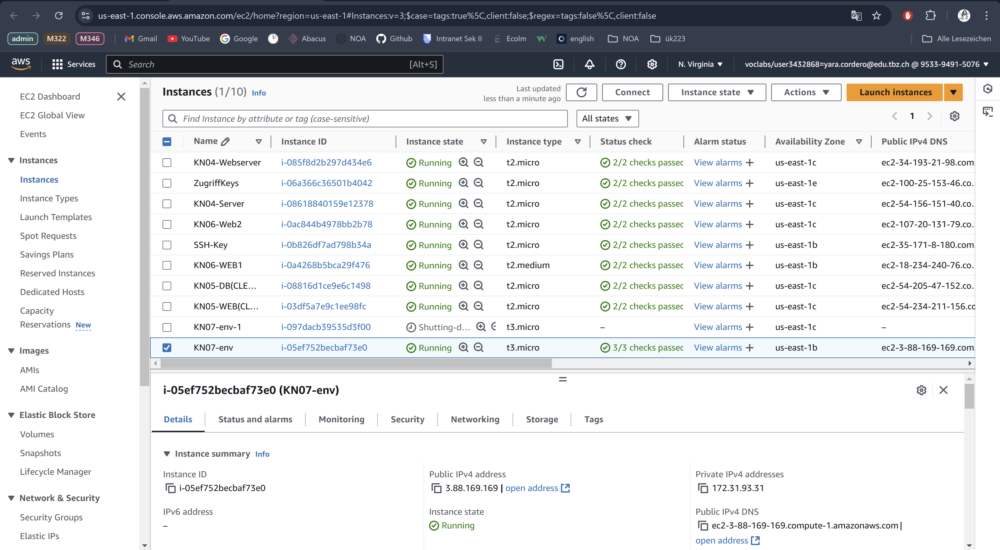

##### Security Groups

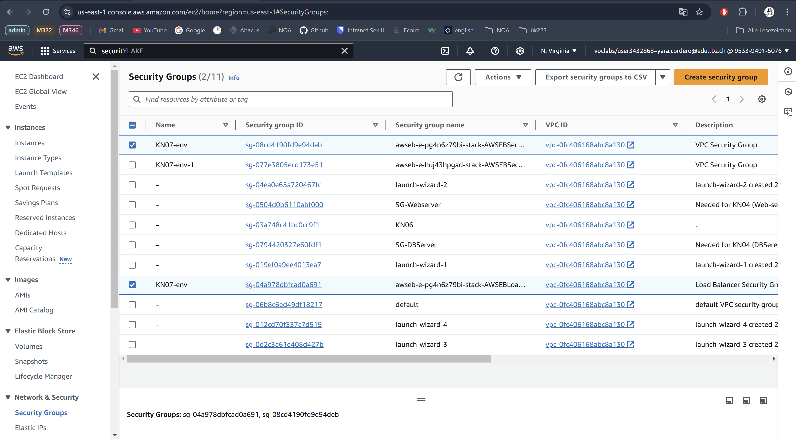

##### Load Balancer

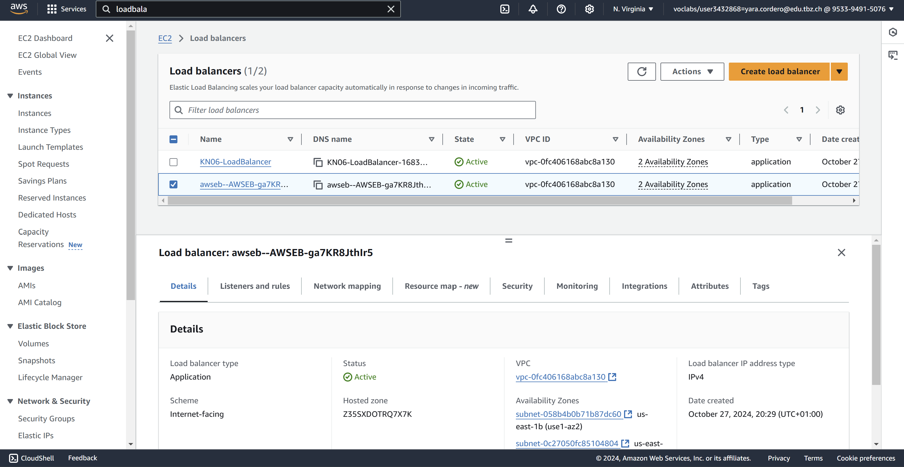

##### Target Groups

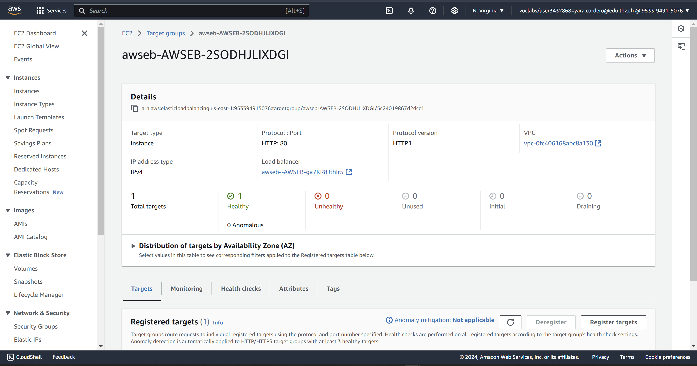

##### Auto-Scaling Groups

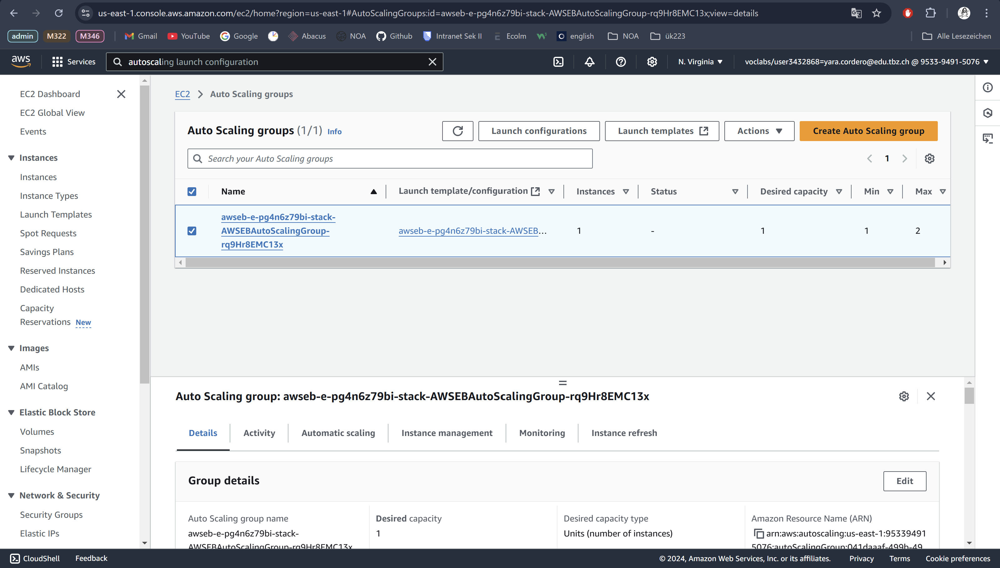

##### Website

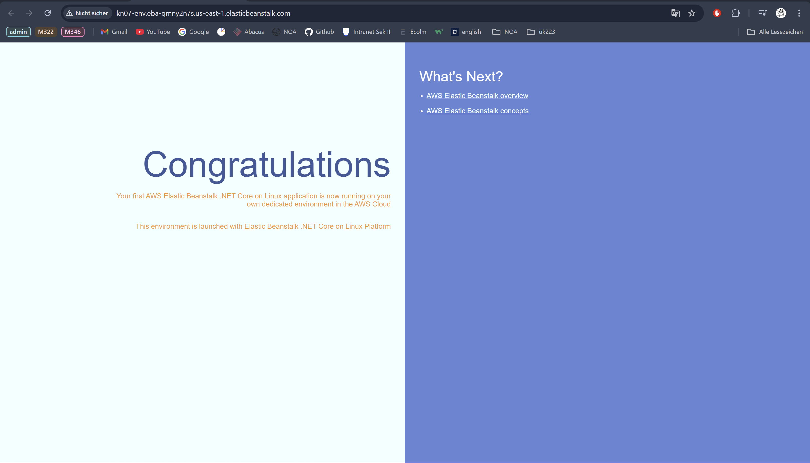

##### CloudFormation

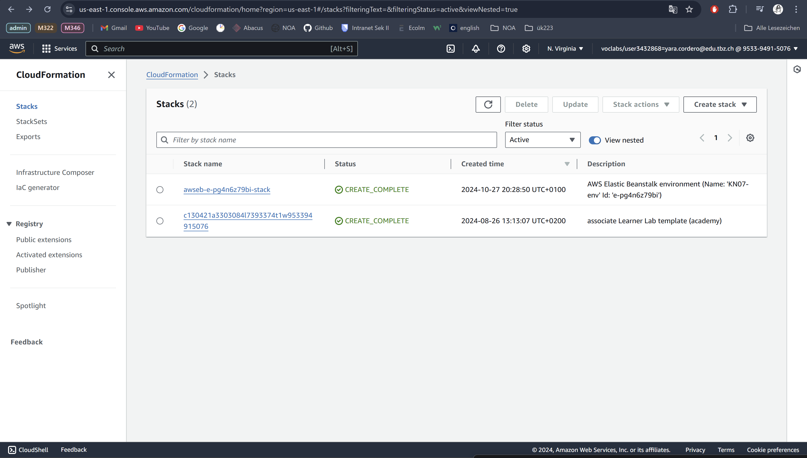

CloudFormation: AWS-Tool, um komplette Infrastruktur (Server, Datenbanken, Netzwerke etc.) durch eine Vorlage aufzubauen und zu verwalten.

Cloud-Init: Tool zur Konfiguration von einzelnen VM-Instanzen beim Start, das innerhalb der VM läuft (z.B. Pakete installieren, User einrichten).

