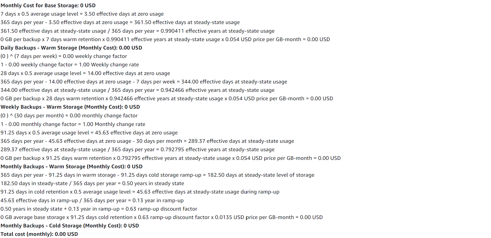

# KN10
## Rehosting 
### AWS 
[PDF Estimate](./AWS_estimate.pdf)

#### Webserver

In den vorherigen Aufgaben wurde eine EC2 Instanz für den Webserver gebraucht, dies mache ich hier gleich.

#### DB 

Da ich in den vorherigen Aufgaben auch eine EC2 Instanz für die DB verwendet haben, werden ich hier auch eine verwenden.

#### Load Balancer

Der Load Balancer wird auch benötigt um die Last auf die Instanzen aufzuteilen und handeln zu können.

#### EBS Backup

Der Grund warum ich eine EBS (Elastic Block Storage) benutze, ist weil ich das schon bei den EC2 Instanzen verwendet habe.

### Azure
[Excel Estimate](./Exportedestimate.xlsx)

