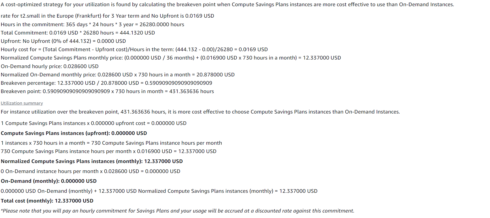
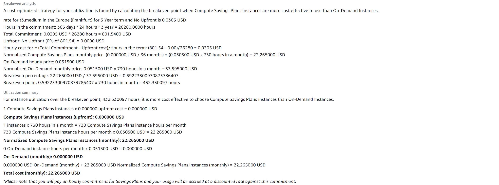

# KN10
## Rehosting 
### AWS 
[PDF Estimate](./AWS_estimate.pdf)

#### Webserver

In den vorherigen Aufgaben wurde eine EC2 Instanz für den Webserver gebraucht, dies mache ich hier gleich.

#### DB 

Da ich in den vorherigen Aufgaben auch eine EC2 Instanz für die DB verwendet haben, werden ich hier auch eine verwenden.

#### Load Balancer

Der Load Balancer wird auch benötigt um die Last auf die Instanzen aufzuteilen und handeln zu können.

#### EBS Backup

Der Grund warum ich eine EBS (Elastic Block Storage) benutze, ist weil ich das schon bei den EC2 Instanzen verwendet habe.

### Azure
[Excel Estimate](./Exportedestimate.xlsx)

## Replattforming

 

 Ich entschied mich für 2 Dynos da sie isolierte Linux Containers sind, wie die EC2 in AWS. Für den Speicher habe ich Redis ausgewählt.

## Repurchasing

### Salescloud CRM

### Zoho CRM

Ich würde mich für die Salescloud Option für 25$ pro Monat entscheiden. Die Salescloud CRM hat eine bessere Skalierungmöglichkeit und ist weltweit mehr gebraucht als die Zoho CRM. Die Preise bei Zoho CRM sind tiefer jedoch ist die Qualität der Salescloud CRM im vergleich besser.

Für ein Unternehmen, das schnell eine leistungsfähige CRM-Lösung benötigt und sich nicht um die technische Infrastruktur kümmern möchte, wäre SaaS (Zoho oder Salesforce) die naheliegendste Wahl. Zoho bietet hier preisliche Vorteile, während Salesforce mehr Flexibilität und erweiterte Funktionen für große Unternehmen bietet.

## Interpretation der Resultate

#### AWS vs. Azure 

Mann sieht bei den Berechnungen das AWS die günstigere Variante der beiden ist. Jedoch finde ich Azure mit ihren VM's komplizierter zu benutzten als AWS mit ihren EC2.

#### Zoho CRM vs. Salecloud CRM

Zoho CRM ist das günstigere Angebot, sowohl auf den monatlichen Preis als auch auf den Umfang der Grundfunktionen bezogen.

Salesforce mag auf den ersten Blick teurer erscheinen, aber für Unternehmen mit sehr spezifischen und komplexen CRM-Anforderungen kann es durch seine erweiterte Funktionalität, bessere Skalierbarkeit und Integration langfristig kosteneffizienter sein. Unternehmen, die einfache CRM-Lösungen mit gutem Funktionsumfang und niedrigeren Kosten benötigen, würden jedoch von Zoho CRM profitieren.

Die endgültige Entscheidung hängt stark von den Anforderungen des jeweiligen Unternehmens, der Komplexität der CRM-Workflows und der Notwendigkeit der Anpassung ab.

 

